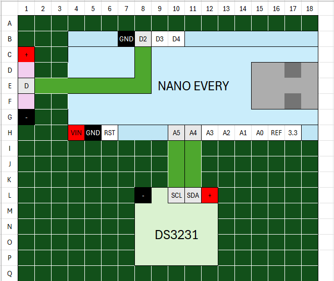
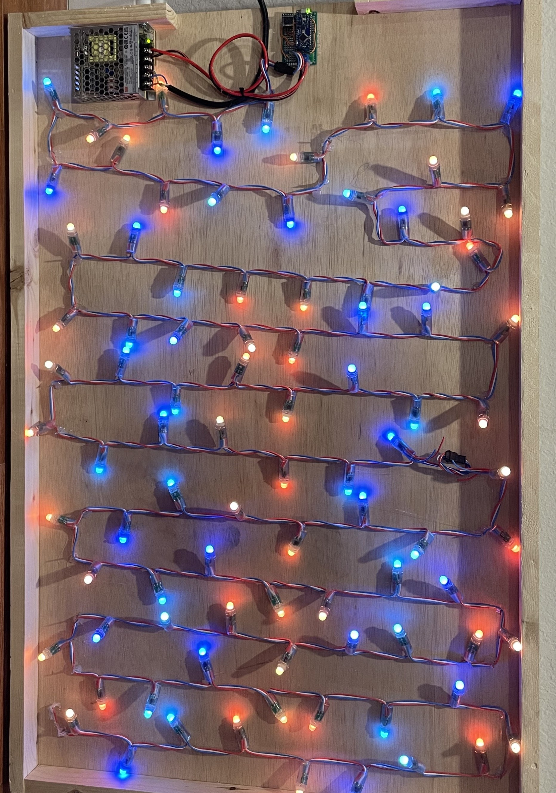

# Synthetic Window

I have lived in an apartment with no windows for almost three years now. It is driving me insane. My circadian rhythm is all out of whack. This project is designed to fix this. I have designed a synthetic window to simulate the sunrise and sunset in order to give my brain some much needed light-based conditioning. This repo will detail how you too can save yourself $1000 dollars by not buying one, and instead building one from nothing more than an Arduino, some lumber, and time. 

    
  <video controls autoplay src="https://github.com/user-attachments/assets/b445cedc-3200-4441-b5c2-e17c6cb7bdc4">
  </video>
  
  <h5>Figure 1. The final product</h5>

## Table of Contents
1. [Code](#code)
2. [Wiring](#wiring)
3. [Woodworking](#woodworking)
    1. [Shadow Box](#shadowbox)
    2. [Frame](#frame)

## Code 
Add a `secrets.h` file containing

    #define LAT [your latitude]
    #define LON [your longitude]

and upload to your preferred microcontroller. (Code assumes you are using an Arduino Nano Every)

Tracks the position of the sun and changes the colors of the LEDs to match below: 

  
  <h5>Figure 2. LED color cycle</h5>

The code should work out of the box, but here is a quick list of pain points that may be worth keeping track of if you want to modify it: 

* The RTC is very finicky. I had to add the `i2c_unstick` function to make sure that when the device is unplugged, the clock can reset itself. Make sure to call this function before calling `Wire.begin()` and `rtc.begin()` (still not sure if the Wire call is necessary). 
* Midnight is the biggest problem for clocks in the world. Make sure to run this thing for 24 hours to make sure it's debugged (or just use the serial input to set the time to 11:59 and wait)
* There is a function called `loop_` that will cycle the colors for the full day. Use this to endlessly fiddle with the constants in `color_calculations.h`. 

## Wiring 

Wire everything up according to the following circuit diagram and your apartment will finally have a window: 

<table>
  <tr>
    <td align="center"></td>
    <td align="center"></td>
  </tr>
  <tr>
    <td align="center">a.) Optimistic Schematic</td>
    <td align="center">b.) Actual Spaghetti Board</td>
  </tr>
</table>

<h5>Figure 3. Wiring Diagram vs Reality</h5>

**Parts list**: 

* Arduino Nano Every
* HiLetGo DS3231 RTC 
* Cheap Amazon WS2811 LEDs (100x)
* 5V, 50W power supply 

Connect the RTC's SDA pin to the Arduino A4 pin, and the SCL pin to the A5. Connect the data pin on the lights to the D2 pin. Wire the positive terminals on the lights and RTC to the positive power supply, and run a jumper from the Arduino VIN pin to the same. Then ground everything to the input ground. 

## Woodworking 

The actual window mounting is two components: a shadowbox to hold the electronics, and mount the LEDs to, and a window to cover everything up. 

### Shadowbox 

<table>
  <tr>
    <td align="center"></td>
    <td align="center"></td>
  </tr>
  <tr>
    <td align="center">a.) Sketch</td>
    <td align="center">b.) Reality</td>
  </tr>
</table>

<h5>Figure 4. Shadowbox component holder</h5>

**Parts List** 

* Fiberboard (Sold in 2'x4', cut to 2'x3')
* 1"x2" furring: 
  * 2x 7" 
  * 2x 36"
  * 1x 22" 
* Diffusers
  * White bedsheet
  * Transparent shower curtain
  * [Mylar sheets](https://www.amazon.com/dp/B0CW5Y9M8N?ref=ppx_yo2ov_dt_b_fed_asin_title&th=1)

You can ask the guy at Home Depot to cut the 8' furring planks into these little peices for you. They won't be happy about it, but they'll do it. 

In hindsight, the little hole for easy access to the electronics was larger than necessary. The PSU fits nicely on the little shelf at the bottom. I was worried I'd need to mount it an extra inch lower, but this ended up being unneccesary. 

Next, drive some nails into the sides of the board to hang the lights from. They will also be hot glued down, but the nails will help support them if the glue fails, and also hold our first diffuser later. 

Finally, affix the controller, the lights, and the power supply to the baseboard. For the PSU, I screwed it into some guide holes I drilled. The controller was light enough to just hot glue in. My finished product looked like this: 

  
  <h5>Figure 5. Components mounted on Shadowbox</h5>

Now, just like this, the window is going to look like a bunch of individual LEDs. Because it is. To try to account for this, we need to do some heavy diffusing. Our first diffuser is a shower curtain I got from Goodwill. Cut it to size, and place it right above the lights. To ensure maximum distance from the lights to each of our successive diffusers, I hot glued the LEDs down to the board. I should have been a little more careful, because this resulted in some areas more illuminated than others. 

<table>
  <tr>
    <td align="center"></td>
    <td align="center"></td>
  </tr>
  <tr>
    <td align="center">a.) Without Diffuser</td>
    <td align="center">b.) With Diffuser</td>
  </tr>
</table>

<h5>Figure 6. First diffuser</h5>

It looks... okay. But we can get even more diffuse. Let's add another layer. For this second one, I used a white sheet that I also got (and maybe should have washed) from the Goodwill. 

  
  <h5>Figure 7. Double Break Diffusion (shower curtain → sheet)</h5>

Looking a bit better. But we can get even more diffuse. Let's go ahead and add another layer of diffusion. For this last layer, I hot glued some transparant mylar sheets over the sheet and curtain layers

<table>
  <tr>
    <td align="center"></td>
    <td align="center"></td>
  </tr>
  <tr>
    <td align="center">a.) 6:30</td>
    <td align="center">b.) 7:30</td>
  </tr>
</table>

<h5>Figure 8. Mylar Diffuser</h5>

Now we're cooking with fire. Next, we'll mount up the frame. The frame will have another mylar layer attached to act as the final diffuser. We're almost finished now. 

### Frame

<table>
  <tr>
    <td align="center"></td>
    <td align="center"></td>
  </tr>
  <tr>
    <td align="center">a.) Sketch</td>
    <td align="center">b.) Reality</td>
  </tr>
</table>

<h5>Figure 9. Window Frame</h5>

**Parts List** 
* 2x: 1"x4"x24" board (pine, I think?)
* 2x: 1"x2"x29" furring
* 1x: As thin as you can find x 1" x 29" wood (I used pine trimming)
* 4x: Above ~10" peices
* Small square wooden dowel rods
* Pocket hole jig 
* Wood glue 

Did you know that a 4x1 board is actually 3.5 x 0.5? I didn't. I made a whole frame only to find out that my 28" vertical bars were 1 inch too short. Turns out, back in the day, lumber was sold by the size it was before it was dried and sanded, so a half-inch was just assumed to be missing any time you bought a peice. Not unlike how a Quarter Pounder is only 0.25lbs before it's cooked. Nowadays, technology has fixed this whole process so the wood you buy is pretty much the same size as it was before it was processed, but they kept the naming convention: all wood is actually half an inch narrower and shallower than advertised. I guess this is a newb mistake, but it feels important to document for any other would-be programmers-turned-woodworkers like myself. 

Luckilly, they sell the 4"x1"s (or, 3.5"x0.75"s (???)) in 8' sections, so I had 4 more feet to work with. And I had some leftover furring from the first step. So after about 15 minutes with my trusty saw, and some sanding, I cut some correctly sized peices and made the above. 

Using a pocket hole jig, drill holes for 2 screws in each corner of the 4" boards. Then, attach them to the 2" vertical bars. Next, sand the thin peice in the middle until you can just squeeze it in between the horizontal peices, and glue it as low as you can push it. 

  
  <h5>Figure 10. Frame over window with double break. No "glass" yet.</h5>

Next up, we need some horizontal peices. For this part, I didn't measure super precisely, I just cut 10" bits of the trim and 10" bits of some small square dowels I found at the home depot that had about the same width as the trimming. These bits will provide support for the final layers of mylar. 

  
  <h5>Figure 11. Frame prepared for mylar mounting</h5>

We're almost finished now. I suppose you can skip this next step if you want, but I like my windows to match the trimming of the rest of my house. Next up, we'll sand this whole thing down, spray it with some white Rust Oleum, and finally mount the last layer of mylar. 

  
  <h5>Figure 12. Final window frame with mylar mounting</h5>

And that's pretty much it. Just screw the frame into the base, add in some saw tooth mounting strips at stud width, and hang it on the wall. 
